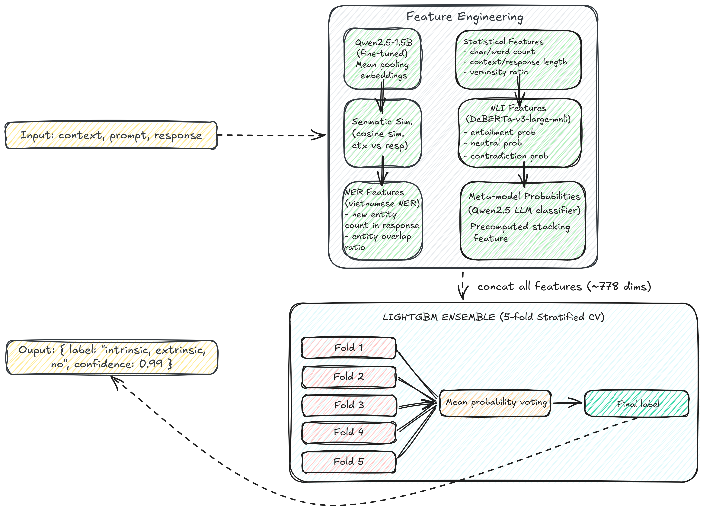

# Vietnamese LLM Hallucination Detection

(a hybrid system that integrates multiple pretrained language models and an ensemble classifier)

---

## Table of Contents

- [System Architecture](#system-architecture)

- [Tech Stack](#tech-stack)
- [Introduction](#introduction)
- [Problem Definition](#problem-definition)
- [Model Design](#model-design)
- [Repository Structure](#repository-structure)
- [Prerequisites](#prerequisites)
- [Installation & Setup](#installation--setup)
  - [1. Local Development (Docker Compose)](#1-local-development-docker-compose)
  - [2. GKE Deployment (Terraform + Ansible)](#2-gke-deployment-terraform--ansible)
  - [3. CI/CD Pipeline](#3-cicd-pipeline)
- [Model Training](#model-training)
- [API Usage](#api-usage)
- [Monitoring & Observability](#monitoring--observability)
- [Configuration](#configuration)

---

## System Architecture

> *(System architecture diagram — coming soon)*

### Inference Flow

> *(Inference flow diagram — coming soon)*

---

## Tech Stack

| Layer | Technology | Purpose |
|-------|-----------|---------|
| **ML Framework** | PyTorch, HuggingFace Transformers | Model fine-tuning and inference |
| **Backbone Models** | Qwen2.5-1.5B, DeBERTa-v3-large | Embedding and NLI features |
| **NER** | undertheseanlp/vietnamese-ner | Named entity extraction |
| **Ensemble** | LightGBM | Final classification |
| **Experiment Tracking** | MLflow | Metrics, artifacts, model registry |
| **Data Versioning** | DVC | Dataset & pipeline versioning |
| **Artifact Storage** | MinIO (local) / GCS (production) | Model and data storage |
| **Backend API** | FastAPI, Uvicorn | Pre/post-processing API |
| **API Gateway** | NGINX | Authentication, rate limiting |
| **Containerization** | Docker, Docker Compose | Local development stack |
| **Container Registry** | GitHub Container Registry (GHCR) | Image storage |
| **Kubernetes** | GKE (Google Kubernetes Engine) | Production orchestration |
| **Model Serving** | KServe, MLServer | Scalable model inference |
| **IaC** | Terraform | GKE cluster provisioning |
| **Configuration Mgmt** | Ansible | K8s stack setup |
| **Package Manager** | Helm | K8s application deployment |
| **CI Pipeline** | GitHub Actions | Test, build, push image |
| **CD Pipeline** | Jenkins | Deploy to GKE |
| **Metrics** | Prometheus, Grafana | System & model metrics |
| **Logging** | Loki, Promtail | Centralized log aggregation |
| **Tracing** | Jaeger (OpenTelemetry) | Distributed request tracing |
| **Drift Detection** | Evidently | Data & model drift monitoring |

---

## Introduction

Large Language Models (LLMs) have demonstrated remarkable performance in natural language understanding and generation. However, a critical limitation of these models is **hallucination** — the tendency to generate responses that are fluent and confident but factually incorrect or unsupported by the given context. This problem poses significant risks in real-world applications, especially in **low-resource languages such as Vietnamese**, where high-quality evaluation benchmarks and detection systems remain limited.

This project presents a **Vietnamese Hallucination Detection System** designed to automatically identify and classify hallucinated responses produced by Vietnamese LLMs. The system operates on a structured input triplet consisting of **context**, **prompt**, and **model response**, and predicts whether the response is faithful to the provided context or contains hallucinated information.

---

## Problem Definition

### Dataset & Input Format

Each data sample contains the following fields:

| Field | Description |
|-------|-------------|
| `id` | Unique identifier for each data instance |
| `context` | A textual passage containing factual information |
| `prompt` | A question or instruction given to the LLM |
| `response` | The answer generated by the LLM based on the context and prompt |
| `label` | The hallucination category assigned to the response |

### Prompt Types

The **prompt** field is designed to test model robustness under different conditions:

- **Factual** — A clean, standard prompt without perturbations
- **Noisy** — A prompt intentionally injected with spelling errors, character noise, or word reordering
- **Adversarial** — A prompt containing misleading cues or "trap" questions intended to provoke hallucinated answers

This design encourages the model to learn hallucination patterns beyond surface-level text matching.

### Hallucination Taxonomy

The task is formulated as a **multi-class classification problem** with three hallucination labels:

**🟢 NO — No Hallucination**

A response is labeled **NO** if and only if it satisfies **all** of the following:
- The response is completely **factually correct and consistent** with the information provided in the context
- It does **not introduce any incorrect or unverifiable information**
- It **answers the prompt correctly** based solely on the context

**🟡 INTRINSIC — Intrinsic Hallucination**

A response is labeled **INTRINSIC** if it satisfies **at least one** of the following:
- It **directly contradicts** or **distorts** information explicitly stated in the context
- The hallucinated content refers to **entities or concepts already present** in the context, but with **altered or incorrect details**
- The response is **plausible-sounding** but factually incorrect within the given context

Intrinsic hallucinations reflect errors where the model misinterprets or manipulates existing contextual information.

**🔴 EXTRINSIC — Extrinsic Hallucination**

A response is labeled **EXTRINSIC** if it satisfies **at least one** of the following:
- It introduces **new information not present** in the context
- The additional information **cannot be inferred** from the context
- The added information may be **true in the real world**, but is **unsupported by the given context**
- The response attempts to answer the prompt while adding **context-independent details**

Extrinsic hallucinations indicate content generation beyond the provided evidence.

---

## Model Design

### Overview

To effectively detect and classify hallucinations, this project proposes a **multi-stage, multi-feature hybrid architecture** that integrates complementary linguistic, semantic, and reasoning-based signals. All extracted features are fused into a unified feature space (~778 dimensions) and fed into a **LightGBM ensemble model** trained with stratified cross-validation.



### Feature Groups

**1. Fine-tuned Qwen2.5-1.5B Embeddings**

The backbone for semantic feature extraction is **Qwen2.5-1.5B**, fine-tuned end-to-end on the hallucination detection task. Qwen2.5-1.5B offers stronger multilingual and reasoning capabilities compared to PhoBERT.

Fine-tuning configuration:
- **Input**: `context + prompt + response` (concatenated)

- **Objective**: Sequence classification (3 classes: NO / INTRINSIC / EXTRINSIC)
- **Optimizer**: AdamW with weight decay (`weight_decay=0.0106`)
- **Scheduler**: Linear learning-rate warmup
- **Learning rate**: `1.01e-05`, **Epochs**: 7, **Batch size**: 16, **Max length**: 256

After fine-tuning, **mean-pooled hidden state embeddings** are extracted and used as the primary semantic representation for each sample.

**2. Statistical Text Features**

Lightweight but effective structural signals:
- Character length and word count for `context`, `prompt`, and `response`

- Response-to-context length ratio
- Helps detect over-generation, unnatural truncation, and verbosity anomalies

**3. Context–Response Semantic Similarity**

Cosine similarity between the embedding of `context` and `response` (using fine-tuned Qwen2.5-1.5B embeddings):

- Low similarity → response likely out-of-context → signal for **extrinsic hallucination**

- High contradiction with high similarity → signal for **intrinsic hallucination**

**4. NLI-Based Logical Consistency Features**

Uses `MoritzLaurer/DeBERTa-v3-large-mnli-fever-anli-ling-wanli` to compute logical relationship probabilities between `context` and `response`:

| Probability | Interpretation |
|-------------|----------------|
| **Entailment** | Response is supported by context → faithful |
| **Neutral** | Response is independent of context → possible extrinsic |
| **Contradiction** | Response conflicts with context → possible intrinsic |

These NLI scores serve as a **reasoning-level consistency signal**, directly complementing the embedding-based features.

**5. NER-Based Hallucination Indicators**

Uses `undertheseanlp/vietnamese-ner-v1.4.0a2` to extract named entities and compute:
- **New entity count**: Number of entities in `response` that do not appear in `context`

- **Entity overlap ratio**: Fraction of response entities that overlap with context entities

A high number of newly introduced entities is a strong indicator of **extrinsic hallucination** (fabricated persons, locations, events, or dates).

**6. Meta-Model Probabilities (Qwen2.5 LLM Classifier)**

Pre-computed prediction probabilities from Qwen2.5 acting as an LLM-based zero-shot classifier. These probability vectors are injected as **stacking features** for LightGBM, providing a high-level semantic signal that complements the lower-level engineered features.

### Training Strategy


- **Objective**: Multi-class classification with softmax

- **Metric**: Macro F1-score (equal weight across all 3 classes)
- **Stratified CV**: Preserves label distribution across folds to prevent imbalance bias
- **Inference**: Mean probability averaging across all 5 fold models → argmax → final label

### Model Performance

| Metric | Score |
|--------|-------|
| OOF Macro F1 | **0.8638** |
| Evaluation dataset | ViHallu |
| Model registry name | `vihallu-detector` |
| Model version | v2 |
| Production alias | `production` |

### Contributions

This system contributes:
- A **clear and well-defined hallucination taxonomy** for Vietnamese LLM evaluation

- A **multi-view feature engineering pipeline** combining semantic, logical, and entity-level signals
- A **practical MLOps framework** with full CI/CD, model registry, and scalable serving via KServe
- A **strong ensemble-based baseline** for future research on hallucination detection in low-resource languages

---

## Repository Structure

```
vietnamese-llm-hallucination-detection/
│
├── backend/                        # FastAPI application
│   ├── model/
│   │   └── inference_model.py      # Ensemble model loader
│   ├── routers/
│   │   └── predict.py              # Prediction endpoint
│   ├── schemas/                    # Pydantic models
│   └── utils/
│       └── preprocessing.py        # Feature extraction
│
├── data/                           # DVC-tracked datasets
│   ├── raw/
│   └── processed/
│
├── docker/                         # Dockerfiles
│   ├── Dockerfile.backend
│   ├── Dockerfile.ci
│   ├── Dockerfile.jenkins
│   └── Dockerfile.nginx
│
├── frontend/                       # User Interface
│
├── iac/                            # Infrastructure as Code
│   ├── ansible/
│   │   └── setup_gke_stack.yaml    # KServe + observability stack
│   └── terraform/
│       └── gke/                    # GKE cluster provisioning
│           ├── main.tf
│           └── terraform.tfvars.example
│
├── kubernetes/                     # K8s manifests
│   ├── charts/
│   │   └── hallucination-backend/  # Helm chart
│   ├── runtimes/
│   │   └── mlflow-cluster-runtime.yaml  # KServe ClusterServingRuntime
│   ├── secrets.yaml
│   └── values/
│       └── backend-prod.yaml
│
├── mlops/
│   ├── dvc/                        # DVC pipeline stages
│   ├── kserve/
│   │   └── inference-service.yaml  # KServe InferenceService
│   └── mlflow/                     # MLflow tracking server config
│
├── models/                         # Local model files (gitignored)
│   └── lgbm/                       # LightGBM fold models
│
├── notebooks/                      # Experiment notebooks
│
├── observability/                  # Monitoring configs
│   ├── grafana/
│   ├── loki/
│   └── prometheus/
│
├── scripts/                        # Utility scripts
│   ├── pull_model_from_registry.py
│   ├── resolve_storage_uri.py
│   └── auto_promote_registry.py
│
├── tests/
│   └── unit/                       # Unit tests (coverage > 80%)
│
├── .github/
│   └── workflows/
│       └── ci.yml                  # GitHub Actions CI pipeline
│
├── Jenkinsfile                     # Jenkins CD pipeline
├── docker-compose.yml              # Local development stack
└── dvc.yaml                        # DVC pipeline definition
```

---

## Prerequisites

| Tool | Version | Purpose |
|------|---------|---------|
| Docker & Docker Compose | ≥ 24.0 | Local development |
| Python | 3.10 | Model training & backend |
| kubectl | ≥ 1.28 | K8s management |
| Helm | ≥ 3.12 | K8s package manager |
| Terraform | ≥ 1.5 | Infrastructure provisioning |
| gcloud CLI | latest | GKE authentication |
| gke-gcloud-auth-plugin | latest | GKE kubectl auth |
| DVC | ≥ 3.0 | Data & pipeline versioning |

---

## Installation & Setup

### 1. Local Development (Docker Compose)

**Clone repository:**
```bash
git clone https://github.com/nhnammldlnlpcvrs/vietnamese-llm-hallucination-detection
cd vietnamese-llm-hallucination-detection
```

**Setup environment:**
```bash
cp iac/terraform/gke/terraform.tfvars.example iac/terraform/gke/terraform.tfvars
# Fill in required values
```

**Start core services (MLflow + MinIO + PostgreSQL):**
```bash
docker compose up -d minio db
sleep 15
docker compose up -d mlflow
```

**Verify MLflow is running:**
```bash
curl http://localhost:5000/health # response: OK
```

MLflow UI at `http://localhost:5000`:

> *(Screenshot: MLflow — experiment runs and metrics)*

> *(Screenshot: MLflow — model registry, vihallu-detector with production alias)*

MinIO UI at `http://localhost:9001` (minioadmin / minioadmin):

> *(Screenshot: MinIO — bucket browser showing model artifacts)*

**Start backend:**
```bash
docker compose up -d backend
# Backend available at http://localhost:8080
```

**Start observability stack:**
```bash
docker compose up -d prometheus grafana loki promtail jaeger
# Grafana: http://localhost:3000
# Prometheus: http://localhost:9090
# Jaeger: http://localhost:16686
```

> *(Screenshot: Grafana — prediction distribution dashboard)*

> *(Screenshot: Prometheus — scrape targets all UP)*

> *(Screenshot: Loki — backend log explorer)*

> *(Screenshot: Jaeger — distributed trace for /api/predict)*

**Start NGINX API Gateway:**
```bash
docker compose up -d nginx-gateway
# API available at http://localhost:80 — requires X-API-Key header
```

---

### 2. GKE Deployment (Terraform + Ansible)

**Configure GCP credentials:**
```bash
gcloud auth login
gcloud auth application-default login
gcloud config set project vihallu-llm-detect
```

**Provision GKE cluster:**
```bash
cd iac/terraform/gke
cp terraform.tfvars.example terraform.tfvars
# Fill in project_id, region, zone

terraform init
terraform plan
terraform apply
```

> *(Screenshot: GCP Console — GKE cluster vihallu-cluster, 2 nodes Ready)*

> *(Screenshot: Terraform apply — resources created successfully)*

**Connect to cluster:**
```bash
gcloud container clusters get-credentials vihallu-cluster \
  --zone asia-southeast1-a \
  --project vihallu-llm-detect
```

**Deploy KServe + Observability stack:**
```bash
cd iac/ansible
ansible-playbook setup_gke_stack.yaml -v
```

**Upload model to GCS:**
```bash
gsutil mb -l asia-southeast1 gs://vihallu-models
gsutil -m cp -r /path/to/model gs://vihallu-models/hallucination-detector/
gsutil uniformbucketlevelaccess set on gs://vihallu-models
gsutil iam ch allUsers:objectViewer gs://vihallu-models
```

> *(Screenshot: GCS Console — vihallu-models/hallucination-detector/model/)*

**Deploy InferenceService:**
```bash
kubectl apply -f kubernetes/runtimes/mlflow-cluster-runtime.yaml
kubectl apply -f mlops/kserve/inference-service.yaml
kubectl get inferenceservice -n hallucination-prod
```

> *(Screenshot: kubectl get inferenceservice — hallucination-detector READY True)*

**Deploy Backend via Helm:**
```bash
kubectl apply -f kubernetes/secrets.yaml

helm upgrade --install hallucination-backend \
  kubernetes/charts/hallucination-backend \
  --namespace hallucination-prod \
  -f kubernetes/values/backend-prod.yaml \
  --wait --timeout=10m
```

> *(Screenshot: kubectl get pods -n hallucination-prod — all pods 2/2 Running)*

---

### 3. CI/CD Pipeline

**GitHub Actions CI** triggers on push to `feature*` and `main`:
```
Push → Unit Tests → Quality Gate (coverage > 80%) → Build & Push Image → Trigger Jenkins
```

**Jenkins CD** (triggered by GitHub Actions on merge to `main`):
```
Checkout → Test → Pull Model → Build Image → Resolve StorageUri → Approval → Deploy Backend → Deploy KServe → Smoke Test
```

**Setup Jenkins:**
```bash
docker compose up -d jenkins
docker exec hallucination-jenkins \
  cat /var/jenkins_home/secrets/initialAdminPassword
# → open http://localhost:8080
```

> *(Screenshot: Jenkins — CD pipeline all stages green)*

> *(Screenshot: GitHub Actions — CI pipeline passed)*

**Required Jenkins credentials:**

| ID | Type | Value |
|----|------|-------|
| `kubeconfig-gke` | Secret file | GKE kubeconfig |
| `ghcr-credentials` | Username/Password | GitHub username + PAT (write:packages) |
| `minio-credentials` | Username/Password | minio / minio123 |

**Required GitHub Secrets:**

| Secret | Value |
|--------|-------|
| `GHCR_TOKEN` | GitHub PAT |
| `MLFLOW_TRACKING_URI` | `http://localhost:5000` |
| `MLFLOW_S3_ENDPOINT_URL` | `http://localhost:9000` |
| `AWS_ACCESS_KEY_ID` | `minio` |
| `AWS_SECRET_ACCESS_KEY` | `minio123` |
| `JENKINS_URL` | `http://<host-ip>:8080` |
| `JENKINS_USER` | `admin` |
| `JENKINS_TOKEN` | Jenkins API token |

---

## Model Training

**Setup environment:**
```bash
conda create -n ai-engineer python=3.10
conda activate ai-engineer
pip install -r requirements.txt
```

**Pull data from DVC remote (MinIO):**
```bash
export AWS_ACCESS_KEY_ID=minio
export AWS_SECRET_ACCESS_KEY=minio123
export MLFLOW_S3_ENDPOINT_URL=http://localhost:9000

dvc pull
```

**Run full training pipeline:**
```bash
dvc repro
```

**Pipeline stages:**
```
preprocess → feature_extraction → train_folds → evaluate → register_model
```

> *(Screenshot: DVC dag — pipeline dependency graph)*

> *(Screenshot: MLflow — experiment runs comparing fold metrics)*

**Model performance (OOF):**
- F1 Score: **0.8638**
- Model: `vihallu-detector` v2
- Alias: `production`

**Promote model to production:**
```bash
python scripts/auto_promote_registry.py
```

> *(Screenshot: MLflow model registry — production alias set on v2)*

---

## API Usage

**Health check:**
```bash
curl http://localhost:8080/health
```

**Predict hallucination:**
```bash
curl -X POST http://localhost:8080/api/predict \
  -H "Content-Type: application/json" \
  -H "X-API-Key: your-api-key" \
  -d '{
    "context": "Hà Nội là thủ đô của Việt Nam",
    "prompt": "Thủ đô của Việt Nam là gì?",
    "response": "Thủ đô của Việt Nam là Tokyo"
  }'
```

**Response:**
```json
{
  "label": "intrinsic",
  "confidence": 0.996
}
```

**Labels:**
- `intrinsic` — Model contradicts information present in the context
- `extrinsic` — Model introduces information not present in the context
- `none` — No hallucination detected

**KServe endpoint (GKE):**
```bash
ISVC_URL=http://hallucination-detector.hallucination-prod.136.110.57.217.nip.io

curl $ISVC_URL/v2/health/live
curl $ISVC_URL/v2/models/hallucination-detector
```

---

## Monitoring & Observability

| Service | Local URL | GKE |
|---------|-----------|-----|
| Grafana | http://localhost:3000 | NodePort |
| Prometheus | http://localhost:9090 | ClusterIP |
| Jaeger | http://localhost:16686 | ClusterIP |
| MLflow | http://localhost:5000 | ClusterIP |
| Evidently | http://localhost:8001 | — |

**Grafana credentials:** `admin / admin`

> *(Screenshot: Grafana — request latency p50/p95/p99)*

> *(Screenshot: Grafana — prediction label distribution over time)*

> *(Screenshot: Grafana — KServe autoscaling metrics)*

> *(Screenshot: Jaeger — end-to-end trace for a single predict request)*

> *(Screenshot: Evidently — data drift detection report)*

**Key metrics tracked:**
- Request latency (p50, p95, p99)
- Prediction distribution per label
- Model confidence score distribution
- Data drift (Evidently)
- KServe queue depth and replica count

---

## Configuration

**Environment variables:**

| Variable | Description | Default |
|----------|-------------|---------|
| `MLFLOW_TRACKING_URI` | MLflow server URL | `http://mlflow:5000` |
| `MLFLOW_MODEL_NAME` | Registered model name | `vihallu-detector` |
| `MLFLOW_MODEL_ALIAS` | Model alias | `production` |
| `MLFLOW_S3_ENDPOINT_URL` | MinIO/S3 endpoint | `http://minio:9000` |
| `AWS_ACCESS_KEY_ID` | MinIO access key | `minio` |
| `AWS_SECRET_ACCESS_KEY` | MinIO secret key | `minio123` |
| `OTEL_EXPORTER_OTLP_ENDPOINT` | Jaeger OTLP endpoint | `http://jaeger:4317` |

**GKE cluster info:**
- Cluster: `vihallu-cluster`
- Region: `asia-southeast1`, Zone: `asia-southeast1-a`
- Node type: `e2-standard-4` (4 vCPU, 16 GB RAM)
- Autoscaling: 1–4 nodes